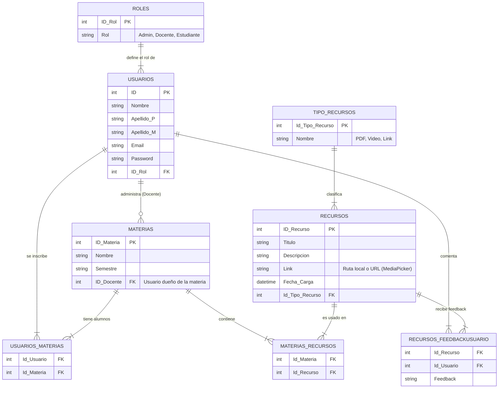

# 🗺️ SkillMap - Gestor de Recursos Educativos

SkillMap es una aplicación móvil desarrollada en **.NET MAUI** con backend en **ASP.NET Core API**, diseñada para facilitar la distribución y gestión de material educativo entre docentes y estudiantes.

## 📝 Caso de Uso (Descripción)

El sistema resuelve la necesidad de centralizar el material de estudio (PDFs, videos, enlaces) que actualmente se pierde en chats o correos.

* **👨‍🏫 Docente:** Inicia sesión, visualiza sus materias asignadas y carga recursos (con título, descripción, link y foto de portada). Puede generar reportes PDF de su material como evidencia.
* **🎓 Estudiante:** Inicia sesión, navega por semestres, selecciona sus materias y consume el contenido subido por el profesor. Puede descargar los recursos.
* **🛡️ Admin:** Se encarga de dar de alta usuarios y materias en el sistema.

---

## 📊 Diagrama Entidad-Relación (DER)

> *Este diagrama se genera automáticamente con código Mermaid.*

---

## 🔐 Matriz de Permisos por Rol

| Funcionalidad | 🛡️ Admin | 👨‍🏫 Teacher | 🎓 Student |
| :--- | :---: | :---: | :---: |
| **Login (Autenticación)** | ✅ | ✅ | ✅ |
| **Ver Materias** | ✅ | ✅ | ✅ |
| **Ver Recursos** | ✅ | ✅ | ✅ |
| **Descargar PDF (Reporte)** | ✅ | ✅ | ✅ |
| **Crear Recursos** | ✅ | ✅ | ❌ |
| **Editar/Eliminar Recursos** | ✅ | ✅ | ❌ |
| **Subir Imágenes (MediaPicker)**| ✅ | ✅ | ❌ |
| **Asignar Materias** | ✅ | ❌ | ❌ |
| **Gestión de Usuarios** | ✅ | ❌ | ❌ |

---

## 🛠️ Tecnologías

* **.NET MAUI 9.0** (Cliente Móvil)
* **ASP.NET Core Web API** (Servidor)
* **SQLite + Entity Framework Core** (Base de Datos)
* **QuestPDF** (Generación de Reportes)
* **MVVM Toolkit** (Arquitectura)
